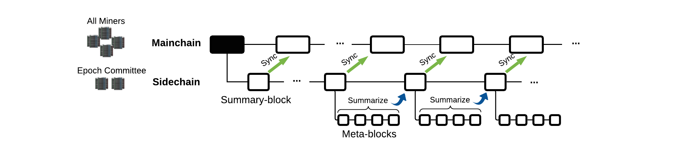

# ChainBoost #
<p align="center"></p>

ChainBoost's official implementation in Go.

ChainBoost is a secure performance booster for blockchain-based resource markets.

We used latest version of [Onet](https://github.com/dedis/onet/tree/v3.2.9) (v.3.2.9) at the time for network, simulation, and communication modules 
as well as [Cosi](https://github.com/dedis/cothority) module from Cothority. 
We used [Kyber](https://github.com/dedis/kyber) for advanced cryptographic primitives.


## Getting Started ##
note: running on an OS other than IOS needs a change in c extention config code

- Install Go
- Clone or Downloade the ChainBoost's source code from Git <https://github.com/chainBoostScale/ChainBoost>
- Open a terminal in the directory where the folder ChainBoost is located
- run the following command: 
```
/usr/local/go/bin/go test -timeout 50000s -run ^TestSimulation$ github.com/ChainBoost/simulation/manage/simulation
```

- this will call the TestSimulation function in the file: ([simul_test.go](https://github.com/chainBoostScale/ChainBoost/blob/master/simulation/manage/simulation/simul_test.go))


raha@R-MacBook-Pro ChainBoost % /usr/local/go/bin/go test -timeout 300000s -run ^TestSimulation$ github.com/ChainBoost/simulation/manage/simulation


- the stored blockchain in Excel file "mainchainbc.xlsx"  can be found under the `build` directory that is going to be created after simulation run[^3]
- in the case of debugging the following code in ([simul_test.go](https://github.com/chainBstSc/ChainBoost/blob/master/simulation/manage/simulation/simul_test.go)) indicates the debug logging level, with 0 being the least logging and 5 being the most (every tiny detail is logged in this level)
```
log.SetDebugVisible(1)
```

## Config File ##

Config File "ChainBoost.toml" is located under the following directory:
([ChainBoost.toml](https://github.com/chainBstSc/ChainBoost/blob/master/simulation/manage/simulation/ChainBoost.toml))


## Project Layout ##

`ChainBoost` is split into various subpackages.

The following packages provide core functionality to `ChainBoost`:

--------------------------------------------------------------------------------------------------
1. these modules from Dedis Lab are used with few modifications: `Onet` (including `Network`, `Overlay`, and `Log`) and `Simulation` 
2. This module from Dedis Lab is used intact: Kyber
3. This module from Algorand is used with some modifications: `VRF`
4. Added modules for ChainBoost:
- `PoR`
- `MainandSideChain` including
  - `Blockchain` package for tx, block structure, measurement, management of tx queues, management of blockchain in two layers 
  - main and side chain's `Consensus protocol` (`BlsCosi` is used for sideChain. part of it is brought from Dedis’s `BlsCosi` with some modifications applied)
--------------------------------------------------------------------------------------------------

- [ ] todo: check if there is any more function/file that should be copied from blscosi to `MainandSideChain` folder and the remove `blscosi` package


<!--FootNote-->
[^1]: there may be some rounds that there is no leader for them, an empty block will be added to the blockchain in those rounds and the information of the root node (blockchain layer 1) is added (it can be removed) as the round leader but all the other columns are empty. in these rounds transactions will be added normally to the queue but no transaction is removed bcz the block is empty.
[^2]: when in a round, some transactions should wait in a queue (i.e. the allocated space for  that transaction is full) and are submitted in another round, the average wait of that queue in the round that those transactions get to be submitted increases.
<!--FootNote-->
